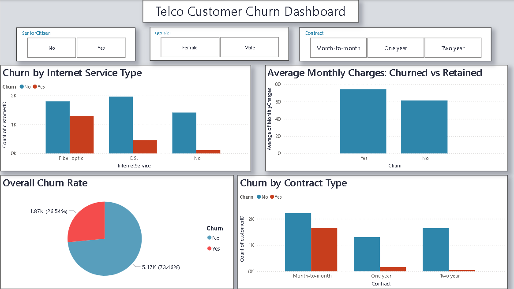

# 📱 Project 1 — Telco Customer Churn Analysis

**Author:** Mahdi
**Dataset:** IBM Telco Customer Churn
**Tools:** Python, Pandas, Matplotlib, Seaborn, Scikit-learn, Power BI

---

## 📌 About This Project
Analysis of 7,043 telecom customers to understand why customers leave
and build a machine learning model to predict future churn.
The company has a 26.54% churn rate — this project identifies the key
drivers and builds a model to predict which customers are at risk.

---

## 🛠️ Tools Used
- Python (Pandas, NumPy, Matplotlib, Seaborn)
- Scikit-learn (Logistic Regression, Random Forest)
- Power BI (Interactive Dashboard)
- GitHub (Version Control)

---

## 📊 Dataset
- **Source:** IBM Telco Customer Churn Dataset (Kaggle)
- **Rows:** 7,043 | **Columns:** 21
- **Target Variable:** Churn (Yes/No)

---

## 🔍 Key Business Insights
- **26.54%** of customers churned — a significant business problem
- Month-to-month customers churn at **42.7%** vs only **2.8%** for two year contracts
- Churned customers pay **$74.44/month** vs **$61.31** for retained customers
- Churned customers stay only **17.98 months** vs **37.65 months** for loyal customers
- Fiber Optic customers churn at **41.9%** despite paying premium prices
- Electronic Check users have the highest churn rate at **45.3%**
- Customers with more services subscribed churn significantly less

---

## 🤖 Machine Learning Models

### Model 1 — Logistic Regression
- Train Accuracy: **81.2%**
- Test Accuracy: **78.8%**

### Model 2 — Random Forest
- Train Accuracy: **89.4%**
- Test Accuracy: **79.5%**

### ✅ Final Model: Logistic Regression
Logistic Regression was chosen as the final model because:
- More interpretable and explainable to business stakeholders
- Performs consistently with minimal overfitting
- Precision and recall scores are well balanced
- Easier to deploy in production environments

---

## 📁 Project Files
- `churn_analysis.ipynb` — Complete Python analysis notebook
- `churn_model.pkl` — Saved trained model (Logistic Regression)
- `Dashboard_Screenshot.png` — Power BI Dashboard

---

## 📷 Dashboard Preview

---

## 🚀 How to Run This Project
1. Download dataset from [Kaggle](https://www.kaggle.com/datasets/blastchar/telco-customer-churn)
2. Open `churn_analysis.ipynb` in VS Code or Jupyter Notebook
3. Run all cells from top to bottom
4. Model will be saved as `churn_model.pkl`

---

## 💡 What I Learned
- Real world data cleaning (hidden null values in TotalCharges)
- Exploratory Data Analysis on customer behavior
- Feature Engineering (encoding categorical variables)
- Building and evaluating ML models
- Comparing model performance using accuracy, precision, recall and F1 score
- Building interactive dashboards in Power BI

---

## 📚 Learning Note
During this project I intentionally performed feature engineering before
visualization to experience real world data challenges. This taught me:
- Why visualization should come before encoding
- How get_dummies affects original columns
- The importance of keeping df_viz and df_ml separate
- How to recreate encoded columns for visualization

This mistake and recovery process gave me deeper understanding of the
complete data preprocessing pipeline.