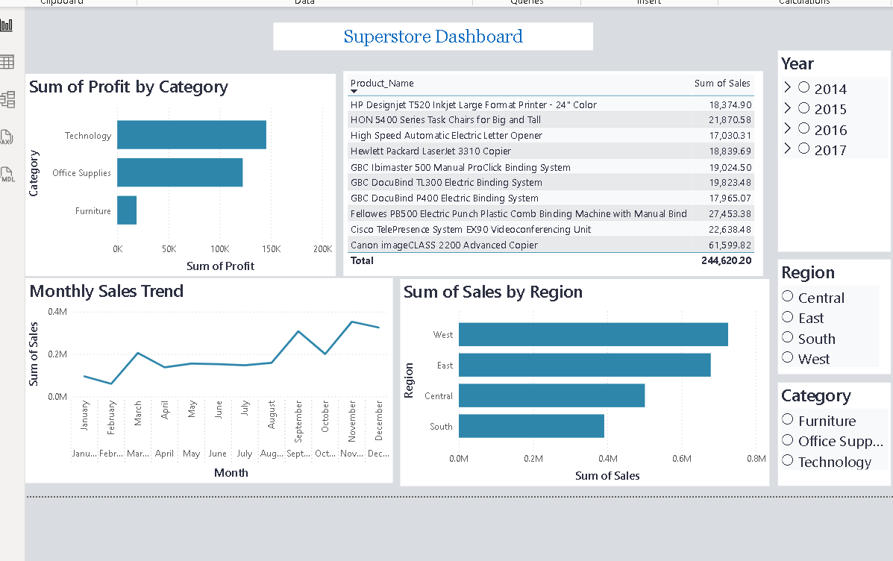

# 🛒 Project 2 — Superstore Sales Dashboard

## 📌 About
Analysis of 9,994 rows of US retail sales data (2014–2017)
to uncover business insights on sales, profit and trends.

## 🛠️ Tools Used
- Python (Pandas, Matplotlib, Seaborn)
- SQL Server (SSMS)
- Power BI

## 📊 Dataset
- Source: Kaggle Superstore Dataset
- Rows: 9,994 | Columns: 21
- Period: 2014 to 2017

## 🔍 Key Insights
- West Region has the highest total sales
- Technology is the most profitable category
- November & December have peak sales (holiday season)
- Furniture has the lowest profit margin
- Discounts above 50% consistently cause losses

## 📁 Project Files
| File | Description |
|---|---|
| `Sales_analysis.ipynb` | Data cleaning & visualization in Python |
| `Superstore_analysis.sql` | SQL queries for business analysis |
| `superstore_clean.csv` | Cleaned dataset |
| `Dashboard_Screenshot.png` | Power BI Dashboard |

## 📷 Dashboard

## 💡 What I Learned
- Data cleaning and handling null values
- Exploratory Data Analysis (EDA)
- Writing SQL queries from basic to advanced
- Building interactive dashboards in Power BI